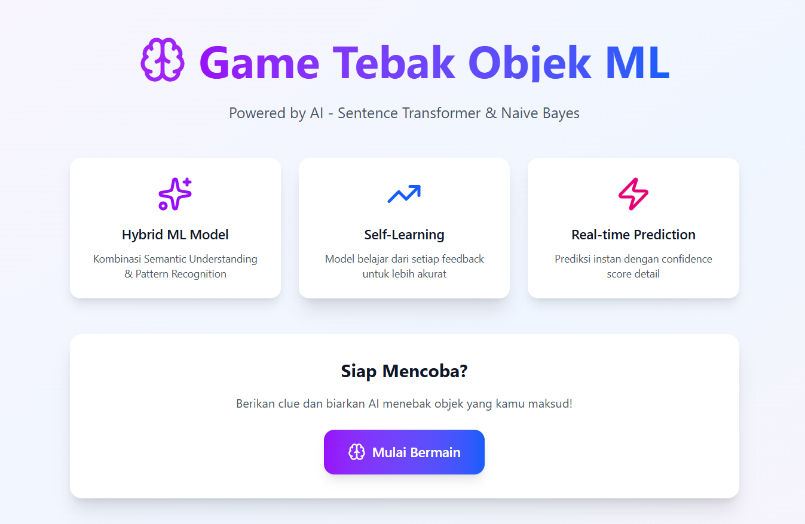
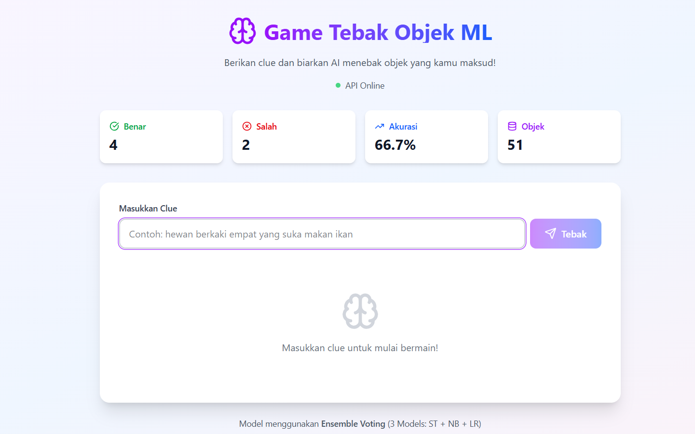
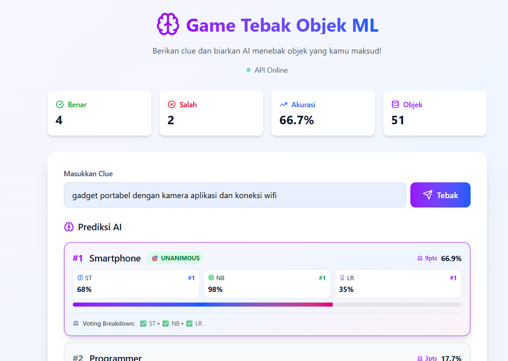

# 🎮 Game Tebak Objek ML

Game interaktif berbasis Machine Learning yang menggunakan **Ensemble Voting** dengan 3 model AI untuk menebak objek berdasarkan clue yang diberikan pengguna.



---

## 🌟 Features

### 🤖 Ensemble Voting System
Sistem menggunakan **3 Model Machine Learning** yang bekerja bersama secara demokratis:

1. **🧠 Sentence Transformer** (all-MiniLM-L6-v2)
   - Memahami makna semantik dan konteks kalimat
   - Cocok untuk clue deskriptif dan panjang
   - Contoh: "hewan pemangsa besar dari keluarga kucing"

2. **🎯 Naive Bayes** (MultinomialNB + TF-IDF)
   - Pengenalan kata kunci yang cepat dan akurat
   - Cocok untuk clue pendek dan spesifik
   - Contoh: "loreng oranye hitam"

3. **🏆 Logistic Regression** (TF-IDF n-gram 1-3)
   - Balance antara semantic dan keyword matching
   - Cocok untuk clue dengan kompleksitas medium
   - Contoh: "binatang buas bergaris"

### 🗳️ Voting Mechanism
- Setiap model memberikan vote untuk top 3 prediksi mereka
- **Rank #1** = 3 poin | **Rank #2** = 2 poin | **Rank #3** = 1 poin
- Objek dengan total poin tertinggi menang
- **Confidence Level**: Unanimous / High / Medium / Low

### ✨ Interactive Learning
- 🔄 **Dynamic Learning**: Model belajar dari setiap feedback
- 📊 **Real-time Stats**: Tracking akurasi, benar, salah
- 💾 **Auto-save**: Dataset diperbarui otomatis setiap 3 feedback
- 🎓 **Smart Training**: Keywords dan clue history untuk pembelajaran lebih cepat

### 🎨 Modern UI/UX
- 🌓 **Dark Mode Support**
- 📱 **Responsive Design**
- 🎭 **Custom Modal Dialogs** (no browser alerts)
- ✨ **Smooth Animations** with loading states
- 🏅 **Confidence Badges** for prediction trust level
- 📊 **3-Model Score Breakdown** with ranks visualization



---

## 🚀 Getting Started

### Prerequisites

**Backend (Flask API):**
- Python 3.8+
- pip

**Frontend (Next.js):**
- Node.js 18+
- npm/yarn/pnpm

### Installation

#### 1️⃣ Clone Repository

```bash
git clone https://github.com/zalzdarkent/game_tebak_objek.git
cd game_tebak_objek
```

#### 2️⃣ Setup Backend (Flask API)

```bash
cd ML

# Create virtual environment
python -m venv venv

# Activate virtual environment
# Windows PowerShell:
.\venv\Scripts\Activate.ps1
# Windows CMD:
.\venv\Scripts\activate.bat
# Linux/Mac:
source venv/bin/activate

# Install dependencies
pip install -r requirements.txt

# Run Flask API
python app.py
```

Flask API akan berjalan di: **http://localhost:5000**

#### 3️⃣ Setup Frontend (Next.js)

```bash
# Dari root project
npm install

# Create .env.local file
echo "NEXT_PUBLIC_API_URL=http://localhost:5000" > .env.local

# Run development server
npm run dev
```

Next.js akan berjalan di: **http://localhost:3000**

---

## 📖 Usage

### Playing the Game

1. **Enter a Clue**: Masukkan deskripsi objek yang ingin ditebak
   ```
   Contoh: "hewan buas loreng oranye hitam"
   ```

2. **View Predictions**: AI akan memberikan top 5 prediksi dengan:
   - 🗳️ **Voting Points**: Total poin dari 3 model
   - 🧠 **Model Scores**: Score individual ST, NB, dan LR
   - 📊 **Ranks**: Posisi di setiap model (#1, #2, #3)
   - 🏅 **Confidence Badge**: Tingkat keyakinan prediksi

3. **Give Feedback**:
   - ✅ **Benar**: Model akan memperkuat pembelajaran
   - ❌ **Salah**: Berikan jawaban benar untuk melatih AI



### API Endpoints

```bash
# Health Check
GET http://localhost:5000/health

# Predict Object
POST http://localhost:5000/predict
Body: {"clue": "hewan berkaki empat", "top_k": 5}

# Submit Feedback
POST http://localhost:5000/feedback
Body: {
  "clue": "mengeong",
  "jawaban_benar": "Kucing",
  "is_correct": true,
  "deskripsi_tambahan": "hewan peliharaan"
}

# Get Statistics
GET http://localhost:5000/stats

# Get All Objects
GET http://localhost:5000/objects
```

---

## 🏗️ Project Structure

```
game_tebak_objek/
├── ML/                                    # Backend (Flask API)
│   ├── app.py                            # Main Flask application
│   ├── requirements.txt                  # Python dependencies
│   ├── daftar_objek_50.csv              # Dataset (50 objects)
│   ├── DATASET_INFO.md                  # Dataset documentation
│   ├── DYNAMIC_WEIGHTING.md             # Algorithm explanation
│   ├── ENSEMBLE_VOTING.md               # Voting system docs
│   └── README.md                         # API documentation
│
├── src/
│   ├── app/
│   │   ├── page.tsx                     # Homepage
│   │   ├── game/
│   │   │   └── page.tsx                 # Main game interface
│   │   ├── layout.tsx                   # Root layout
│   │   └── globals.css                  # Global styles
│   │
│   └── lib/
│       ├── api.ts                       # API client functions
│       └── utils.ts                     # Utility functions
│
├── public/
│   └── evidence/                        # Screenshots
│       ├── image.png
│       ├── image1.png
│       └── image2.png
│
├── components.json                       # shadcn/ui config
├── next.config.ts                        # Next.js config
├── tsconfig.json                         # TypeScript config
├── tailwind.config.ts                    # Tailwind CSS config
├── package.json                          # Node dependencies
├── .env.local                            # Environment variables
└── README.md                             # This file
```

---

## 🧠 Machine Learning Architecture

### Ensemble Voting Workflow

```
User Input: "hewan buas loreng"
           ↓
    ┌──────────────────┐
    │  Preprocessing   │
    └──────────────────┘
           ↓
    ┌──────────────────────────────────┐
    │     3 Models Run in Parallel     │
    └──────────────────────────────────┘
           ↓
    ┌──────────────────┐  ┌──────────────────┐  ┌──────────────────┐
    │ Sentence Trans.  │  │  Naive Bayes     │  │ Logistic Regr.   │
    │  1. Harimau (3)  │  │  1. Harimau (3)  │  │  1. Harimau (3)  │
    │  2. Macan (2)    │  │  2. Singa (2)    │  │  2. Macan (2)    │
    │  3. Zebra (1)    │  │  3. Gajah (1)    │  │  3. Singa (1)    │
    └──────────────────┘  └──────────────────┘  └──────────────────┘
           ↓                      ↓                      ↓
    ┌──────────────────────────────────────────────────────┐
    │           Voting & Aggregation                       │
    │  Harimau: 9 pts (UNANIMOUS) ✅                       │
    │  Macan: 4 pts                                        │
    │  Singa: 3 pts                                        │
    └──────────────────────────────────────────────────────┘
           ↓
    ┌──────────────────┐
    │  Final Prediction│
    │  → Harimau       │
    │  Confidence: 🎯  │
    └──────────────────┘
```

### Confidence Levels

| Level | Criteria | Description |
|-------|----------|-------------|
| 🎯 **UNANIMOUS** | All 3 models rank #1 | Semua model sepakat 100% |
| ✨ **HIGH** | Votes ≥ 7 | Minimal 2 model sangat setuju |
| 🔍 **MEDIUM** | Votes ≥ 4 | Ada konsensus tapi tidak kuat |
| ⚠️ **LOW** | Votes < 4 | Model tidak sepakat |

---

## 🛠️ Tech Stack

### Backend
- **Flask 3.0.0** - Web framework
- **Sentence Transformers 2.3.1** - Semantic understanding
- **Scikit-learn 1.3.2** - ML algorithms (NB, LR)
- **PyTorch 2.1.2** - Deep learning framework
- **Pandas 2.1.4** - Data manipulation
- **Flask-CORS 4.0.0** - Cross-origin support

### Frontend
- **Next.js 16.0.3** - React framework
- **TypeScript** - Type safety
- **Tailwind CSS v4** - Styling
- **Lucide React** - Icons
- **shadcn/ui patterns** - UI components

---

## 📊 Dataset

Dataset berisi **50 objek** dengan 5 kolom:

| Column | Description | Example |
|--------|-------------|---------|
| `objek` | Nama objek | Harimau |
| `deskripsi` | Deskripsi lengkap | Hewan karnivora bergaris loreng |
| `kategori` | Kategori objek | Hewan |
| `kata_kunci` | Keywords penting | loreng, buas, kucing |
| `difficulty` | Tingkat kesulitan | medium |

**11 Kategori**: Hewan, Profesi, Makanan, Elektronik, Olahraga, Alat Musik, Kendaraan, Tumbuhan, Permainan, Hobi, Alat

---

## 🎯 Performance

### Expected Metrics

| Metric | Before Ensemble | After Ensemble | Improvement |
|--------|----------------|----------------|-------------|
| **Accuracy** | 70-75% | 80-85% | +10-15% |
| **Response Time** | 100-150ms | 150-200ms | +50ms |
| **False Positive** | Baseline | -30% | Better |
| **Consensus Rate** | N/A | ~65% | New metric |

### Test Cases

```bash
# Unanimous (All models agree)
Clue: "mengeong" → Expected: Kucing (9 pts)

# High Confidence
Clue: "hewan buas loreng" → Expected: Harimau (≥7 pts)

# Medium Confidence
Clue: "alat musik tradisional" → Expected: Various (≥4 pts)

# Low Confidence (Ambiguous)
Clue: "benda bulat" → Expected: Multiple candidates (<4 pts)
```

---

## 🔮 Future Improvements

- [ ] **Contextual Learning**: Multi-turn conversation dengan memory
- [ ] **Confidence Threshold**: Request additional clue jika confidence rendah
- [ ] **Active Learning**: Prioritas pembelajaran dari low-confidence predictions
- [ ] **Hint System**: Berikan hint berdasarkan kategori
- [ ] **Gamification**: Points, badges, leaderboard
- [ ] **Multi-language**: Support bahasa lain
- [ ] **Voice Input**: Speech-to-text untuk clue
- [ ] **Image Recognition**: Upload gambar sebagai clue

---

## 📝 License

This project is open source and available under the [MIT License](LICENSE).

---

## 👨‍💻 Author

**zalzdarkent**
- GitHub: [@zalzdarkent](https://github.com/zalzdarkent)

---

## 🙏 Acknowledgments

- [Sentence Transformers](https://www.sbert.net/) - Semantic text embeddings
- [Scikit-learn](https://scikit-learn.org/) - Machine learning algorithms
- [Next.js](https://nextjs.org/) - React framework
- [Tailwind CSS](https://tailwindcss.com/) - Utility-first CSS
- [shadcn/ui](https://ui.shadcn.com/) - UI component patterns

---

## 📞 Support

Jika ada pertanyaan atau issue, silakan:
1. Buka [GitHub Issues](https://github.com/zalzdarkent/game_tebak_objek/issues)
2. Atau hubungi via GitHub profile

---

**⭐ Jika project ini bermanfaat, jangan lupa kasih star ya!**
